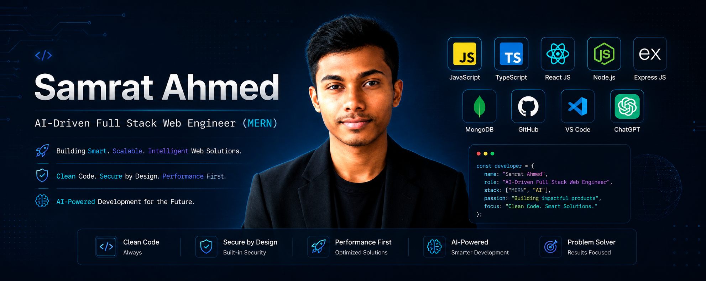

  

<h2 align="center">
Hi - Welcome 
</h2>

<h3 align="center">
  AI-Driven Web Application Engineer | MERN Stack
</h3>

 I'm Samrat Ahmed (Dhaka, Bangladesh), a Bangladeshi  AI-Driven Web Application Engineer | MERN Stack. I'm exploring building Modern, Responsive and Production-Oriented Web Applications with JavaScript, TypeScript, React, Next.js and the MERN Ecosystem.

---

:coffee: &emsp;Connect with me!

    

---

## 🚀 Current Activities

* 🌱 I'm exploring **Next.js** and Modern Web Development.
* 🔐 I'm learning **Authentication and Authorization** with Modern Authentication Solutions.
* 💻 I'm building Responsive and Production-Oriented Web Applications.
* 🧠 I'm exploring **AI-Assisted Software Development** and AI-Powered Application Features.
* 📚 I'm continuously improving my **JavaScript and TypeScript** skills.
* 🚀 I'm working toward becoming a stronger **MERN Stack Full Stack Web Application Engineer**.
* 🛠️ I'm building and improving personal projects to strengthen my practical development skills.

---

## 🛠️ Skills & Technologies

#### Things I code with

        
### Tools & Platforms

---

## 📊 GitHub Statistics

  

  

  

---

  <i>Building, learning and improving — one project at a time.</i>

